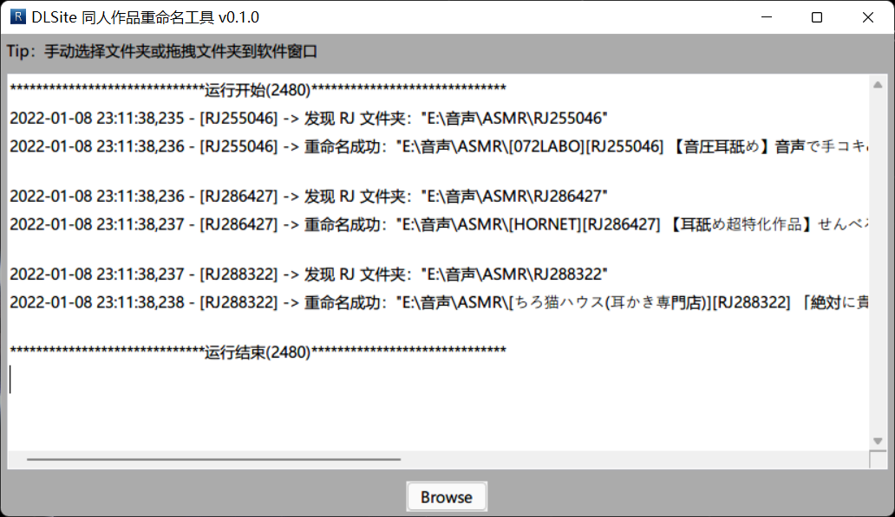

# dlsite-doujin-renamer


## Features
- 支持深度查找 RJ 文件夹
- 支持手动选择文件夹或拖拽文件夹到软件窗口
- 支持在 ```config.json``` 中设置软件配置
- 支持在 ```cache.db``` 中缓存从 [dlsite.com](https://www.dlsite.com/maniax/) 抓取的元数据

## Config
示例配置
```json
{
  "scaner_max_depth": 5,
  "scraper_locale": "zh_cn",
  "scraper_connect_timeout": 10,
  "scraper_read_timeout": 10,
  "scraper_sleep_interval": 3,
  "scraper_http_proxy": null,
  "renamer_template": "[maker_name][rjcode] work_name cv_list_str",
  "renamer_exclude_square_brackets_in_work_name_flag": false
}
```
- ```scaner_max_depth``` 扫描器的扫描深度
- ```scraper_locale``` 刮削器的刮削元数据的语言（```["en_us", "ja_jp", "ko_kr", "zh_cn", "zh_tw"]``` 中的一个）
- ```scraper_connect_timeout``` 刮削器的 [requests 连接超时](https://docs.python-requests.org/zh_CN/latest/user/advanced.html#timeout)时间（秒）
- ```scraper_connect_timeout``` 刮削器的 [requests 读取超时](https://docs.python-requests.org/zh_CN/latest/user/advanced.html#timeout)时间（秒）
- ``scraper_sleep_interval`` 刮削器的请求网页的时间间隔（秒）
- ```scraper_http_proxy``` 刮削器的使用的代理（http代理），此项设置为 ```null``` 时，将尝试使用系统代理
- ```renamer_template``` 命名器的命名模板，命名器将替换模板中的关键字：
  - ```rjcode``` 同人作品的 RJ 号
  - ```work_name``` 同人作品的名称
  - ```maker_id``` 同人作品的社团 RG 号
  - ```maker_name``` 同人作品的社团名称
  - ```release_date``` 同人作品的发售日期
  - ```cv_list_str``` 同人作品的声优列表
- ```renamer_exclude_square_brackets_in_work_name_flag``` 命名器的 ```work_name``` 中是否排除 ```【】``` 及其间的内容

【注】**请不要使用 Windows 系统自带的「记事本」编辑配置文件，建议使用 [Notepad3](https://www.rizonesoft.com/downloads/notepad3/)、[Notepad++](https://notepad-plus-plus.org/) 或 [Visual Studio Code](https://code.visualstudio.com/) 等专业的文本编辑器**。本软件的配置文件 ```config.json``` 使用**不带 BOM 的标准 UTF-8** 编码，但在 Windows 记事本的语境中，所谓的「UTF-8」指的是带 BOM 的 UTF-8。因此，用 Windows 系统自带的记事本编辑配置文件后，会导致本软件无法正确读取配置。
